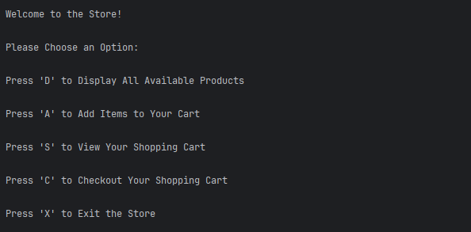
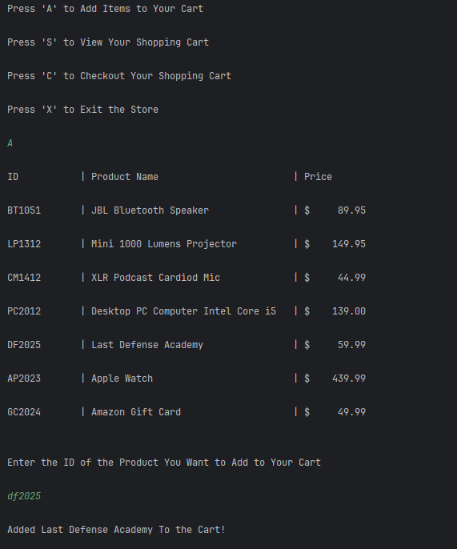
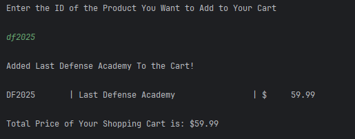
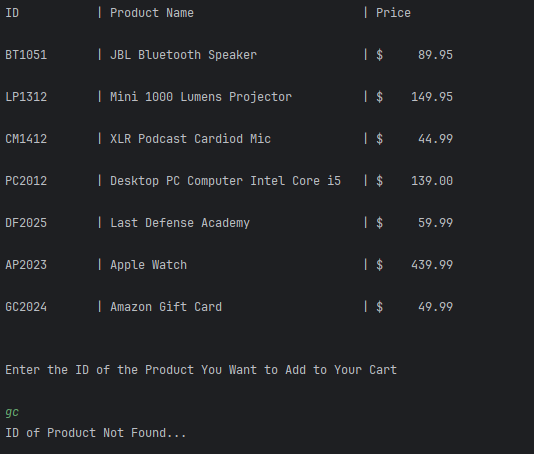

# Online Store - Brandon Morse

## The Online Store is a technology store application that allows the user to view, purchase and check out tech products via a cart. 

## User Stories

- As a customer, I want to view the Online Store's list of products, so I can make a decision on what to purchase.

- As a customer, I want to add things to my cart, so I can see my total price for all my items.

- As a customer, I want to clear my cart once I've checked out so the next time I go to the Online Store I don't have unwanted charges.

- As a developer, I want the customer to provide an amount equal or greater than their cart total so they can pay the correct amount and receive change if needed.

## Setup

1. Create the Store class and Product class
2. Create a constructor, getters and setters in the product class
3. Create a buffered reader to read the list of products from the Products.csv file
4. Create a main menu with a switch case that will lead customers to their desired destination
5. Create a method that allows customers to add items to their cart
6. Create a method that allows the customer to view the total of their cart and insert an amount equal or greater to it in order to successfully check out and clear their cart.

### Prerequisites

- IntelliJ IDEA: Ensure you have IntelliJ IDEA installed, which you can download from [here](https://www.jetbrains.com/idea/download/).
- Java SDK: Make sure Java SDK is installed and configured in IntelliJ.

### Running the Application in IntelliJ

Follow these steps to get your Online Store Application running within IntelliJ IDEA:

1. Open IntelliJ IDEA.
2. Select "Open" and navigate to the directory where you cloned or downloaded the project.
3. After the project opens, wait for IntelliJ to index the files and set up the project.
4. Find the main class with the `public static void main(String[] args)` method.
5. Right-click on the file and select 'Run 'YourMainClassName.main()'' to start the application.

## Technologies Used

- IntelliJ (Amazon Corretto 17.0.14)

## Demo

## Future Work

- Custom Search to be Implemented for the online store!

## Resources

- [W3 Schools for Documentation ](https://www.w3schools.com/java/ref_string_format.asp)

## Team Members

- **Brandon Morse** - Application Development

## Interesting Code

I created a for loop inside the else statement for the checkOut method that will continuously add the amount of each product only if the cart is not empty.

## Thanks!

- Thank you to Mr. Raymond for continuous support and guidance!
